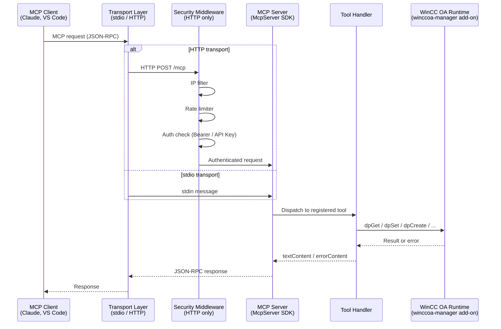

# WinCC OA MCP Server — Architecture

## Overview

`winccoa-mcp-server` runs as **customer code** inside a WinCC OA Node.js Manager. It wraps the native `winccoa-manager` add-on in an MCP server, exposing WinCC OA operations as LLM-callable tools.

The server supports two transports:
- **stdio** — for local MCP clients (Claude Desktop, VS Code) that start the process directly
- **HTTP** — for network-accessible deployments with full security middleware

---

## Request Flow



---

## HTTP Security Middleware Stack

When `MCP_TRANSPORT=http`, the following middleware is applied in order on every `POST /mcp` request:

```
POST /mcp
  │
  ▼
┌─────────────────────────────────────┐
│  express.json({ limit: "1mb" })     │  Body parsing
└─────────────────────────────────────┘
  │
  ▼
┌─────────────────────────────────────┐
│  CORS middleware (if enabled)       │  Cross-origin headers
└─────────────────────────────────────┘
  │
  ▼
┌─────────────────────────────────────┐
│  IP filter (if enabled)             │  Whitelist / blacklist check → 403
└─────────────────────────────────────┘
  │
  ▼
┌─────────────────────────────────────┐
│  Rate limiter (if enabled)          │  Per-IP request count → 429
└─────────────────────────────────────┘
  │
  ▼
┌─────────────────────────────────────┐
│  Auth middleware                    │  Bearer token or X-API-Key → 401
└─────────────────────────────────────┘
  │
  ▼
┌─────────────────────────────────────┐
│  Session manager                    │  Map<sessionId, SSEServerTransport>
│  (session cleanup every 5 min)      │  with lastActivity timestamp
└─────────────────────────────────────┘
  │
  ▼
  MCP Server (McpServer SDK)
```

`GET /health` bypasses all authentication and middleware — it is always accessible.

---

## Directory Structure

```
winccoa-mcp-server/
├── src/
│   ├── index.ts                  # Entry point: transport selection, HTTP server setup
│   ├── server.ts                 # McpServer factory, tool + resource registration
│   ├── constants.ts              # ENABLED_TOOLS filter, CHARACTER_LIMIT
│   ├── winccoa-client.ts         # WinccoaManager singleton (getWinccoa / setWinccoaInstance)
│   │
│   ├── config/
│   │   └── server-config.ts      # loadConfig() + validateConfig() — HTTP security config
│   │
│   ├── tools/
│   │   ├── register-all.ts       # Registration orchestrator with TOOLS category filter
│   │   ├── dp-*.ts               # 10 datapoint tools
│   │   ├── archive-*.ts          # 4 archive tools
│   │   ├── alarm-*.ts            # 4 alarm tools
│   │   ├── common-*.ts           # 3 common metadata tools
│   │   ├── pv-range-*.ts         # 3 PV range tools
│   │   ├── manager-*.ts          # 8 manager/system tools
│   │   ├── opcua-*.ts            # 5 OPC UA tools
│   │   ├── ascii-*.ts            # 2 ASCII export/import tools
│   │   ├── script-execute.ts     # CTRL script execution
│   │   └── *.test.ts             # Vitest unit tests (co-located)
│   │
│   ├── resources/
│   │   ├── systemprompt.md       # LLM system instructions (instructions://system)
│   │   ├── conventions.md        # WinCC OA naming conventions (instructions://conventions)
│   │   └── fields/
│   │       ├── default.md        # General SCADA guidelines (instructions://field)
│   │       ├── oil.md            # Oil & gas guidelines
│   │       └── transport.md      # Transportation / signalling guidelines
│   │
│   └── utils/
│       ├── error-handler.ts      # handleWinccoaError() — WinCC OA error normalisation
│       ├── formatters.ts         # textContent(), errorContent(), safeJsonStringify()
│       ├── manager-num.ts        # Own manager number detection (-num argv / MCP_MANAGER_NUM)
│       └── dp-type-helpers.ts    # Node ↔ JSON structure conversion for DP types
│
├── dist/                         # Built output (esbuild CJS bundle + .env + resources)
├── docs/                         # This documentation
├── .github/
│   └── workflows/
│       ├── ci.yml                # Typecheck + test + build (Node 18/20/22 matrix)
│       └── release.yml           # npm publish on GitHub release
├── .env.example                  # Documented configuration template
├── package.json
├── tsconfig.json
└── vitest.config.ts
```

---

## Component Responsibilities

### `src/index.ts` — Entry Point

- Loads `.env` via `dotenv`
- Reads `MCP_TRANSPORT`
- **stdio path**: creates `StdioServerTransport`, connects directly to `McpServer`
- **HTTP path**: creates Express app, applies security middleware stack, manages SSE session map with periodic cleanup (every 5 minutes, expiry 30 minutes), creates `https.createServer` when SSL is enabled

### `src/server.ts` — MCP Server Factory

- `createServer()` instantiates `McpServer` with name/version
- Calls `registerTools(server)` and `registerResources(server)`
- Resources registered:
  - `instructions://system` — `systemprompt.md`
  - `instructions://conventions` — `conventions.md`
  - `instructions://field` — `fields/<WINCCOA_FIELD>.md`
  - `instructions://project` — custom file from `WINCCOA_PROJECT_INSTRUCTIONS` (or placeholder)

### `src/tools/register-all.ts` — Tool Orchestrator

- Defines a `CATEGORIES` map (category name → array of tool names)
- Reads `ENABLED_TOOLS` from `src/constants.ts`
- For each tool: calls its `register*()` function only if the tool's name or its category appears in `ENABLED_TOOLS` (or `ENABLED_TOOLS` is `null` = load all)
- Logs which tools were loaded and which were skipped

### Individual Tool Files

Each tool file exports a `register*(server)` function that calls:

```typescript
server.registerTool(
  "winccoa_tool_name",
  {
    title: "Human-readable title",
    description: "LLM-facing description",
    inputSchema: z.object({ ... }),
    annotations: { readOnlyHint: true }   // or destructiveHint, openWorldHint
  },
  async (args) => {
    try {
      const winccoa = getWinccoa();
      const result = await winccoa.dpGet([...]);
      return textContent(safeJsonStringify(result));
    } catch (e) {
      return errorContent(handleWinccoaError(e));
    }
  }
);
```

### `src/winccoa-client.ts` — Singleton

- `getWinccoa()` returns the `WinccoaManager` instance (throws if not initialised)
- `setWinccoaInstance(mock)` allows test injection of a mock without importing the native add-on

### `src/config/server-config.ts` — Security Config

- `loadConfig()` parses all `MCP_*` env vars into a typed `ServerConfig` object
- `validateConfig(config)` throws descriptive errors for missing required settings

### `src/utils/`

- `error-handler.ts` — `handleWinccoaError(e)` converts WinCC OA errors and JS errors to a consistent string format
- `formatters.ts` — `textContent(str)`, `errorContent(str)`, `safeJsonStringify(obj, limit)` (truncates at `MCP_CHARACTER_LIMIT`)
- `manager-num.ts` — `getOwnManagerNum()` reads the manager's own number from `-num` argv or `MCP_MANAGER_NUM` env (used for self-stop prevention)
- `dp-type-helpers.ts` — `nodeToJson()` / `jsonToNode()` for DP type structure serialisation

---

## Build System

esbuild bundles all TypeScript into a single CJS file:

```
npm run build
  └── esbuild src/index.ts → dist/index.js (CJS, bundled)
      ├── external: winccoa-manager   (native add-on, loaded at runtime)
      └── copy: .env.example → dist/.env (if not exists), src/resources/** → dist/resources/
```

The single-bundle approach ensures the server works in the WinCC OA Node.js Manager environment without a `node_modules` tree.

---

## Test Architecture

Tests use **Vitest** with a mock `winccoa-manager` module at `src/__mocks__/winccoa-manager.ts`.

Each tool test follows this pattern:

```typescript
import { beforeEach, describe, expect, it, vi } from "vitest";
import { setWinccoaInstance } from "../winccoa-client.js";
import { McpServer } from "@modelcontextprotocol/sdk/server/mcp.js";

describe("winccoa_tool_name", () => {
  let invoke: (args: unknown) => Promise<unknown>;

  beforeEach(() => {
    const mockWinccoa = { dpGet: vi.fn(), dpSetWait: vi.fn(), ... };
    setWinccoaInstance(mockWinccoa as any);

    const server = new McpServer({ name: "test", version: "0.0.0" });
    // Capture the handler by intercepting registerTool
    let handler: Function;
    vi.spyOn(server, "registerTool").mockImplementation((_name, _meta, h) => {
      handler = h;
    });
    registerMyTool(server);
    invoke = (args) => handler(args);
  });

  it("returns expected result", async () => {
    mockWinccoa.dpGet.mockResolvedValue([42]);
    const result = await invoke({ dpeName: "TestDP.value" });
    expect(result).toMatchObject({ content: [{ type: "text" }] });
  });
});
```

The mock (`src/__mocks__/winccoa-manager.ts`) is a Vitest auto-mock that provides `vi.fn()` implementations for all `WinccoaManager` methods. The native add-on is never loaded during tests.

---

## CI / CD

### `.github/workflows/ci.yml`

Triggered on push to `main` and on pull requests.

| Job | Command | Node versions |
|-----|---------|---------------|
| `typecheck` | `npx tsc --noEmit` | 20.x |
| `test` | `npx vitest run --coverage` | 18.x, 20.x, 22.x |
| `build` | `npm run build` | 20.x |

The native `winccoa-manager` add-on is stubbed in CI via `.github/ci-stubs/winccoa-manager/` (a minimal `package.json` + empty `index.js`) so that `npm install` succeeds without the real WinCC OA installation.

### `.github/workflows/release.yml`

Triggered when a GitHub release is published.

1. Checkout → Node 18 → `npm ci`
2. Typecheck → test → build
3. `npm publish --provenance --access public`
4. Upload `.tgz` artifact to the GitHub release
